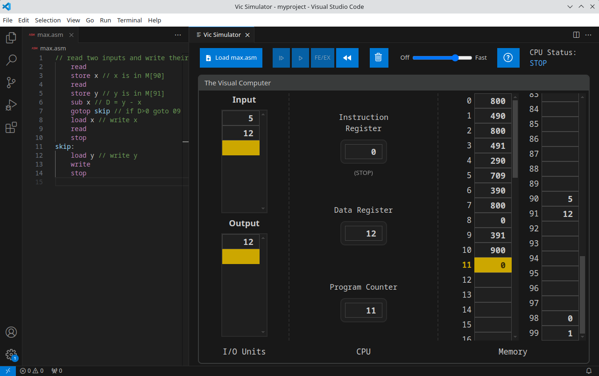

# vic-ide

Visual Computer (Vic)

Vic website: <https://shimonschocken.wixsite.com/visualcomputer>

## Web Demo

A demo is available that can be run directly in your web browser:
<https://vic-ide.github.io/vic-ide/>

## Visual Studio Code Extension

The main way to use Vic is to use the Visual Studio Code Extension:

<https://marketplace.visualstudio.com/items?itemName=vic-ide.vic-ide>

The simulator runs directly inside a panel in Visual Studio Code, and you can directly edit and load Vic source files.

## Getting Started

Please see the [Getting Started Guide](docs/getting-started.md)

## Development

### UI

The project uses the following minimalistic CSS reset:
<https://github.com/Andy-set-studio/modern-css-reset>
