# Vic IDE Getting Started Guide

## Install the extension

Open the extensions panel in the VS Code sidebar.

Search for the "Vic IDE" extension.

Click the "Install" button.

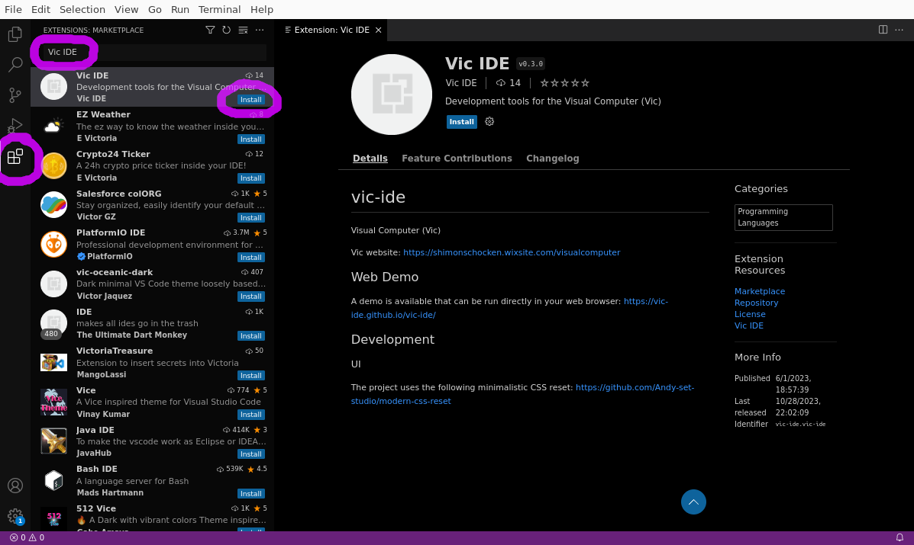

## Open the Vic Simulator

After the extension is installed, you can open the Vic Simulator inside VS Code.

Open the VS Code "Command Palette" (from the "View" menu or using the keyboard shortcut):

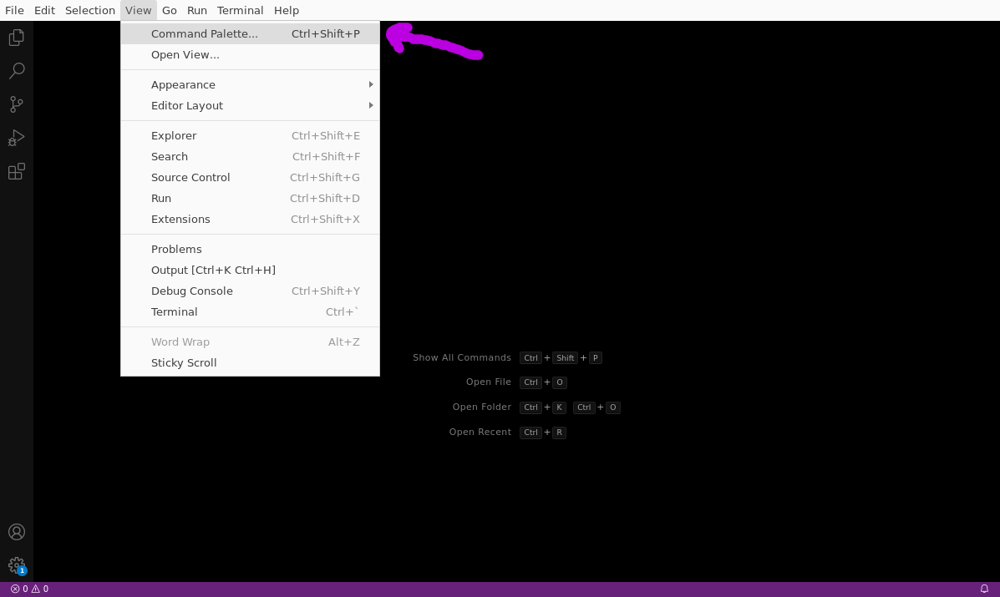

Search for the "vic simulator" command and run it:

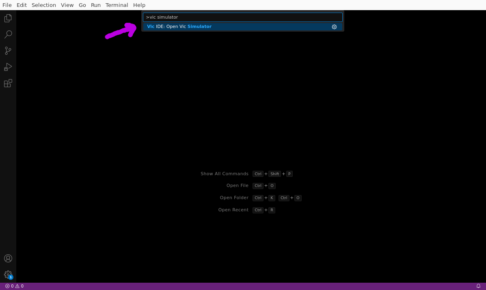

The Vic Simulator is now open:

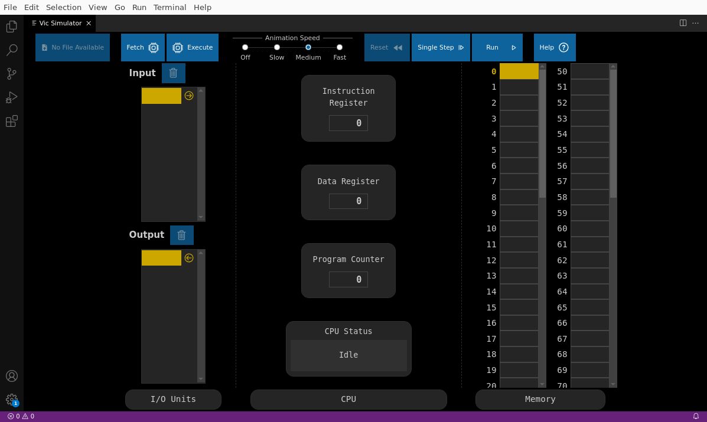

The simulator is initially blank. You can enter a program by entering memory values into the memory cells and input cells and then use the toolbar buttons to run the program.

## Working with Source Files (Vic assembly and Vic binary)

Use the regular file manager to create a new directory (folder) on your computer (for example, call it "MyVicProject").

You can leave it empty, or you can add one or more Vic source files.

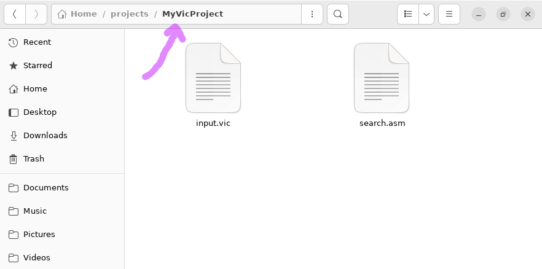

Vic assembly source files should have the extension `.asm`

Vic binary source files should have the extension `.bin`

Go back to VS Code, and choose the menu item "File" → "Open Folder":

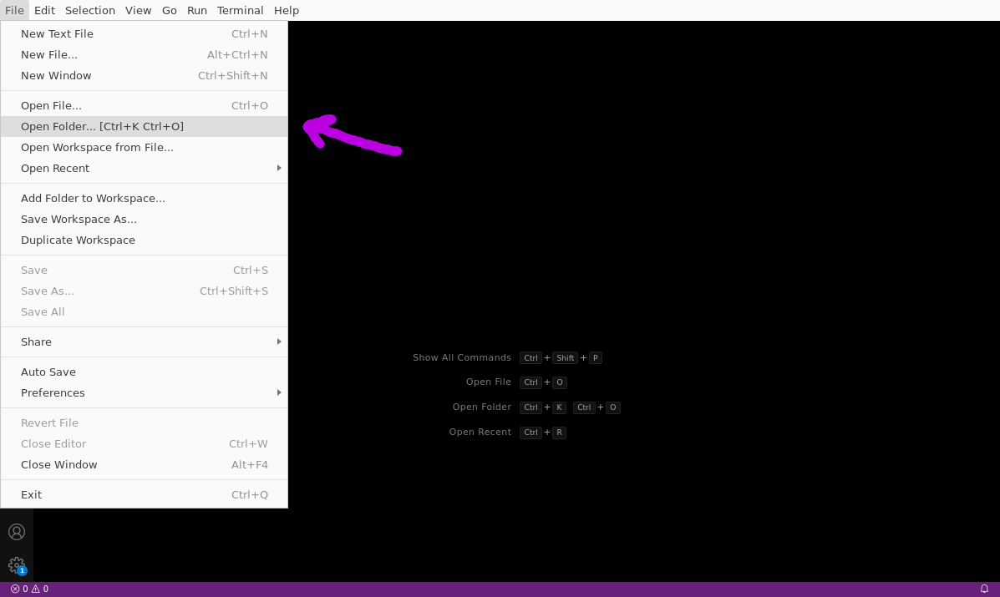

Select the project folder that you created.

You may get a security dialog asking if you trust the folder. If so, you must choose "Yes" so that the Vic IDE features will work:

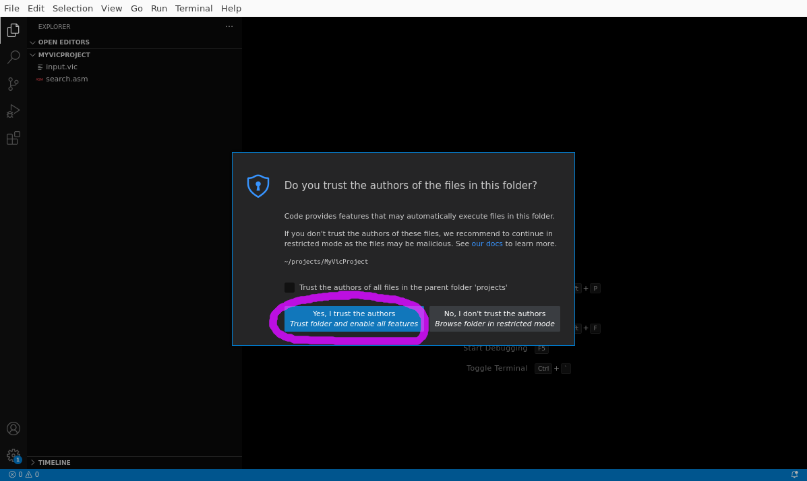

After you have opened the folder, the VS Code File browser will show your files.

If your project is empty, you can create new files/folders using the buttons:

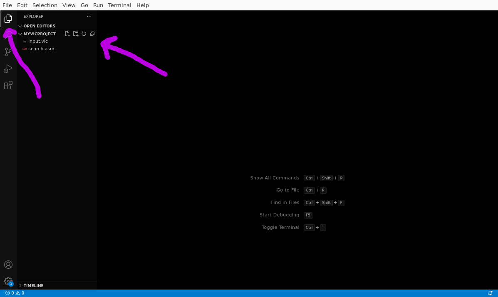

Remember that Vic assembly source files should have the extension `.asm`

And Vic binary source files should have the extension `.bin`

You can double click a file to open it.

After opening a file, VS Code should automatically detect that the file is of type "Vic Assembly" or "Vic Binary".

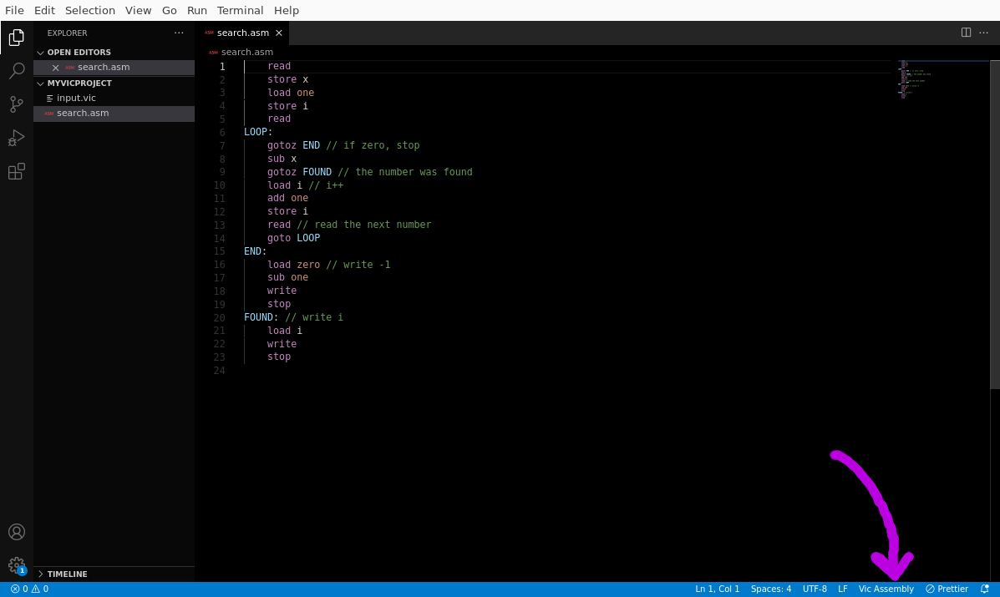

If the file is not properly detected, then click the File type and change it to the correct type (this can happen if you have other VS Code extensions installed that also work with `.asm` files or `.vic` files).

When you have a Vic file open, you can open the Vic simulator again, and this time it will open to the side of your file.

Open the command palette and open the Vic Simulator:

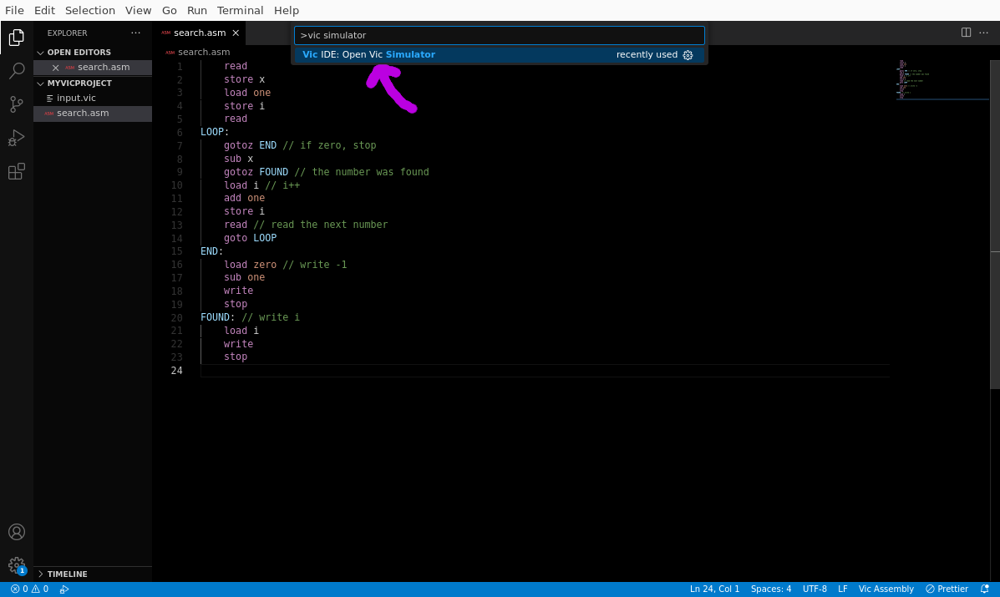

The Vic Simulator will now open to the side of your source file. You can load your program into the simulator by clicking the "Load" button:

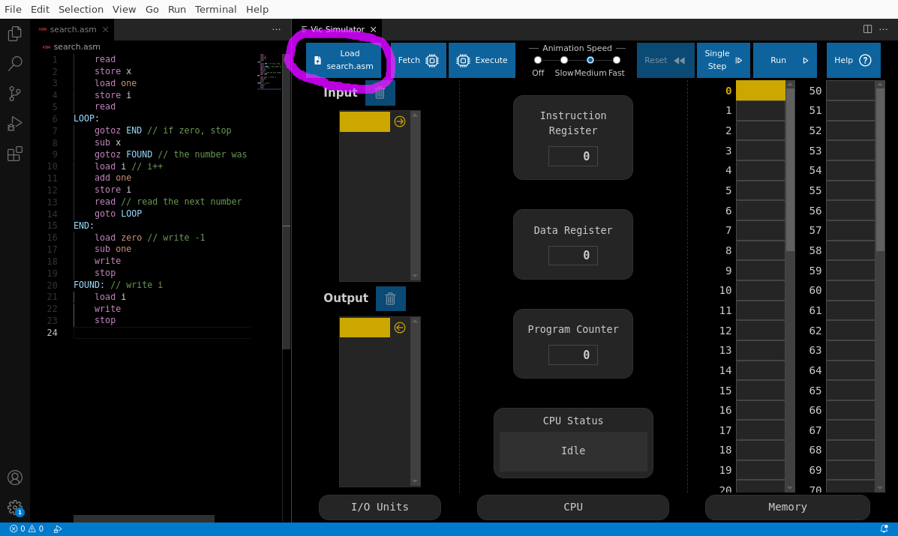

Now the source code has been compiled and the resulting binary code is loaded into the simulator memory:

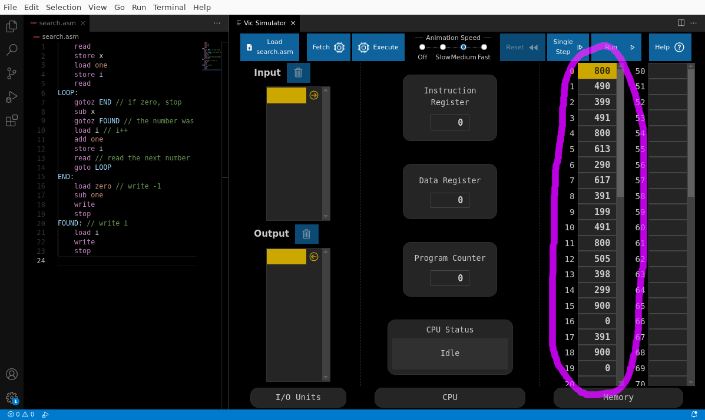

You can enter values into the "Input" cells, and then run the program, and continue to operate the simulator as you wish.

After you make changes to the source code file, click the "Load" button to load it into the simulator memory.

If there are errors in your program, then you will get an error that you cannot load the program because there are errors:

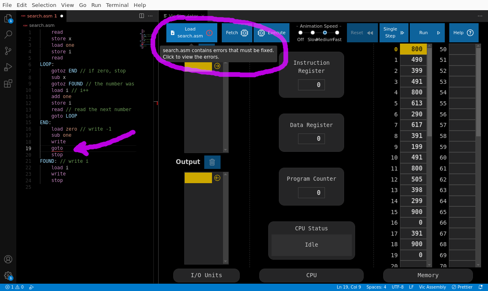

Open the VS Code problems panel to view the error details:

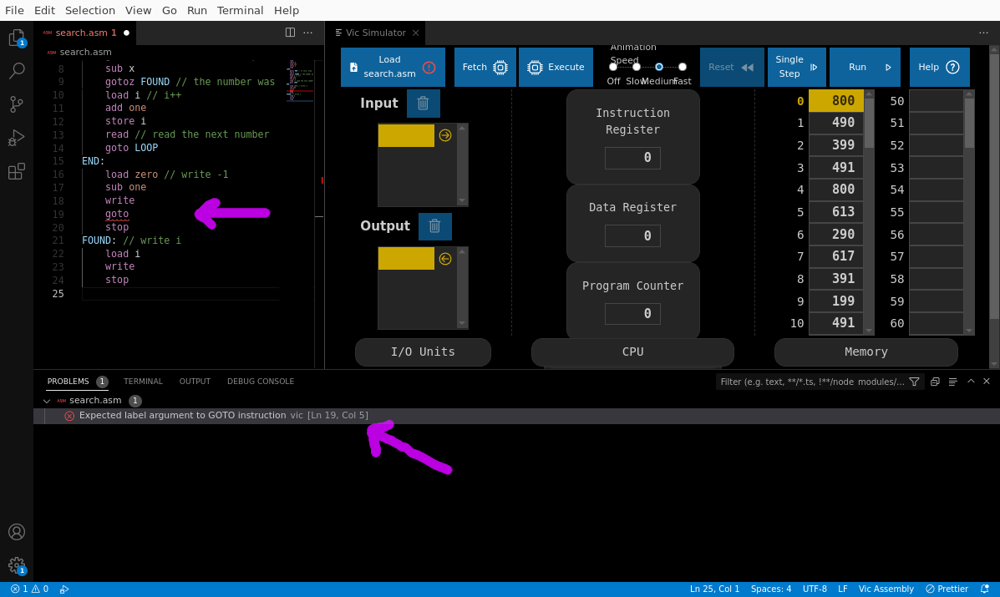

After you fix the errors, the "Load" button will succeed.

## More Tips

- The "Help" button in the Vic Simulator toolbar opens a help window with the list of all Vic instructions. You can pin it to the side to keep it open as you work.
- You can also hover over errors with your mouse and a tooltip will popup giving you the error detail.
- You can also open the Vic Simulator, and load the current program into it by using the menu item "Run" → "Start Debugging" (or keyboard shortcut `F5`)
- You can automatically fix the indentation of your Vic source files by running the command "Format Document" (from the command palette, or from the right-click menu).
- VS Code contains built-in source control tools using Git. You can access these from "View" → "Source Control". This can help you keep track of changes that you make to your source files, as well as allow collaboration between multiple people. See: [Using Git source control in VS Code](https://code.visualstudio.com/docs/sourcecontrol/overview)
